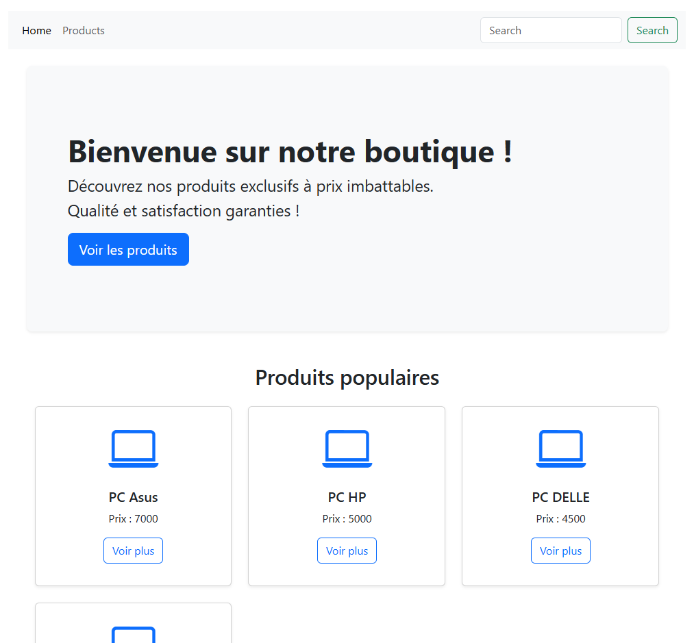
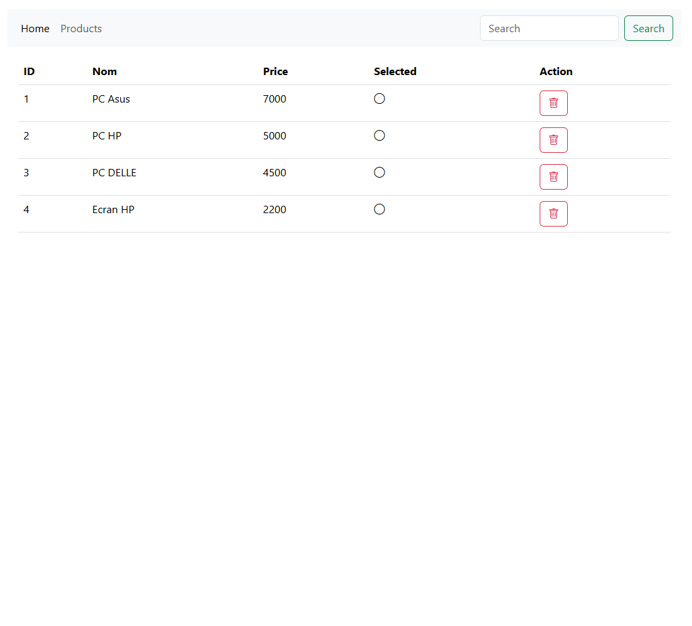
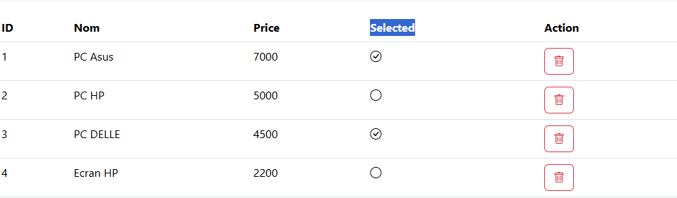
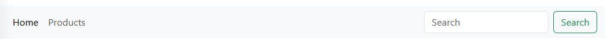
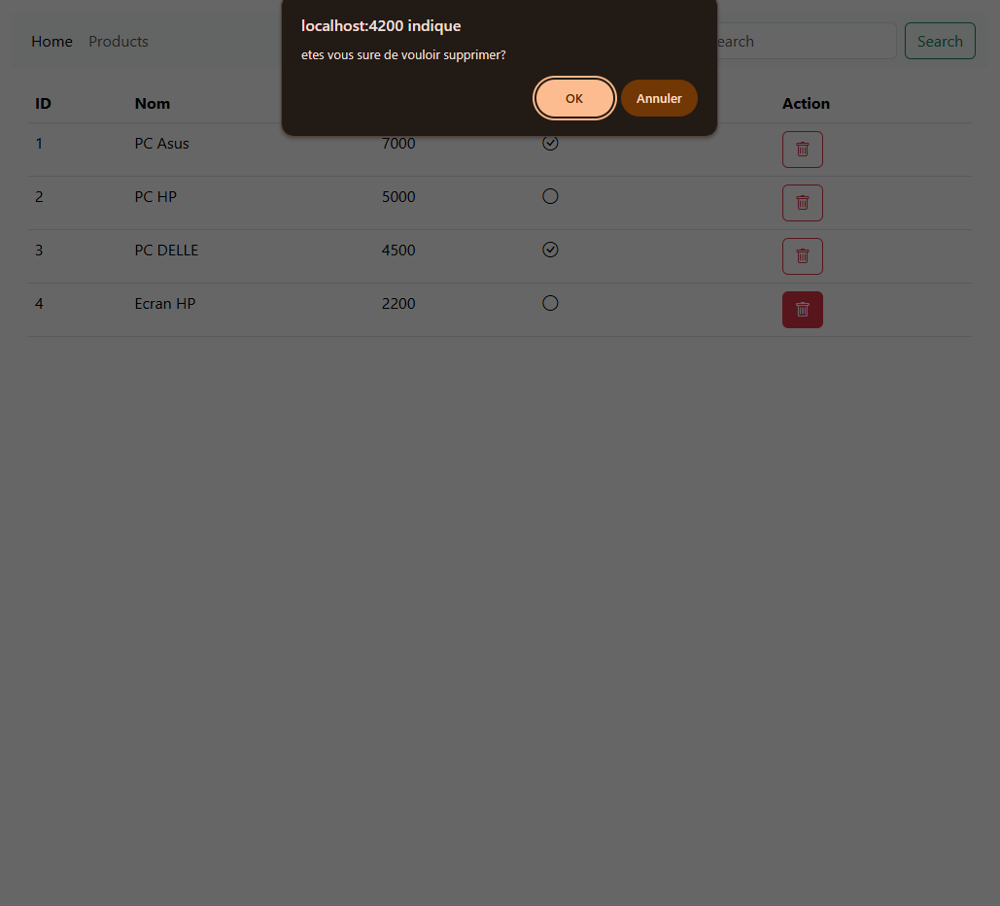
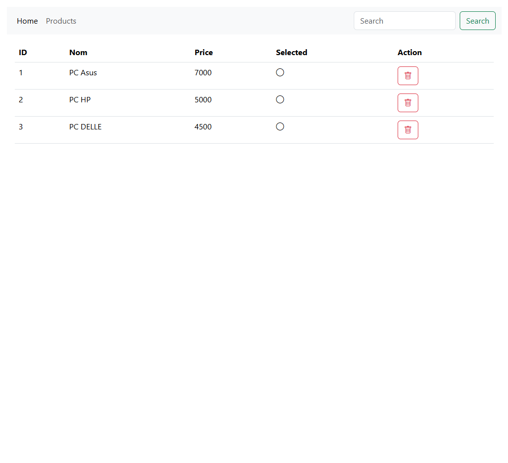

# Projet Angular - Boutique de Produits

## Description générale

Ce projet est une application web développée avec **Angular** dans le cadre d’un TP visant à maîtriser la création de composants, la gestion des routes, la consommation d’API REST, et l’utilisation de Bootstrap pour le design.

L’application permet de présenter une boutique en ligne simple avec :

- Une page d’accueil (`HomeComponent`) qui affiche un message de bienvenue ainsi qu’une sélection des produits populaires.
- Une page de gestion des produits (`ProductsComponent`) qui liste tous les produits disponibles avec la possibilité de sélectionner ou supprimer un produit.
- Un service Angular (`ProductService`) qui communique avec une API REST pour récupérer, supprimer et gérer les produits.

---

## Structure du projet

### 1. Composants principaux

- **HomeComponent**
  - Affiche un bandeau de bienvenue avec un message promotionnel.
  - Affiche une liste dynamique de produits populaires sous forme de cartes avec icônes.
  - Utilise le service `ProductService` pour récupérer les produits depuis l’API.

- **ProductsComponent**
  - Présente un tableau listant tous les produits.
  - Permet de sélectionner un produit (avec changement d’icône).
  - Permet la suppression d’un produit avec confirmation.
  - Consomme également `ProductService` pour les opérations CRUD.

### 2. Service Angular

- **ProductService**
  - Service injectable singleton qui utilise `HttpClient` pour communiquer avec un backend REST (URL `http://localhost:8081/products`).
  - Fournit des méthodes pour récupérer tous les produits (`getAllProduct()`) et supprimer un produit (`deleteProduct(product)`).

### 3. Design et ergonomie

- Utilisation de **Bootstrap 5** pour la mise en forme, les grilles, boutons, tables, et icônes (Bootstrap Icons).
- Navigation simplifiée via la barre de navigation avec routing Angular entre `Home` et `Products`.
- Composants standalone Angular pour modularité et simplicité.

---

## Fonctionnalités

- Consultation dynamique des produits depuis un backend.
- Interface utilisateur responsive et moderne.
- Actions utilisateur : sélection visuelle, suppression sécurisée.
- Navigation fluide entre pages.

---

## Technologies utilisées

- Angular (version récente avec composants standalone)
- TypeScript
- Bootstrap 5 & Bootstrap Icons
- HttpClient Angular pour appels API REST
- Backend (non détaillé ici) fournissant une API REST sur `localhost:8081`

---

## Lancement du projet

1. Installer les dépendances Angular :
   ```bash
   npm install

2. Lancer le serveur Angular : :
   ```bash
   ng serve
3. Assurer que le backend est lancé et accessible sur http://localhost:8081.
4. Ouvrir dans un navigateur :
   http://localhost:4200
## Captures d’écran
 ### Page d’accueil (HomeComponent)

*La page d’accueil affiche un bandeau de bienvenue et une sélection des produits populaires.*

---

### Liste des produits (ProductsComponent)

 
*Cette page présente les produits sous forme de tableau avec ID, nom, prix, état de sélection, et bouton de suppression.*

---

### Icônes de sélection


*Un clic sur l’icône change l’état du produit (sélectionné ou non). Cela s’affiche avec une icône `bi-check-circle` ou `bi-circle`.*

---

### Suppression de produit

  
*Lorsque l’utilisateur clique sur la corbeille, une boîte de confirmation s’affiche avant suppression du produit.*

---

### Barre de navigation

 
*La barre de navigation permet de passer facilement de la page d’accueil à la page produits. Elle est responsive et intègre un champ de recherche (non fonctionnel dans cette version).*

---

### Produits populaires (en cartes)

*Les produits populaires sont affichés dans des cartes modernes avec des icônes (ordinateur, smartphone, etc.) et un bouton "Voir plus".*

---

